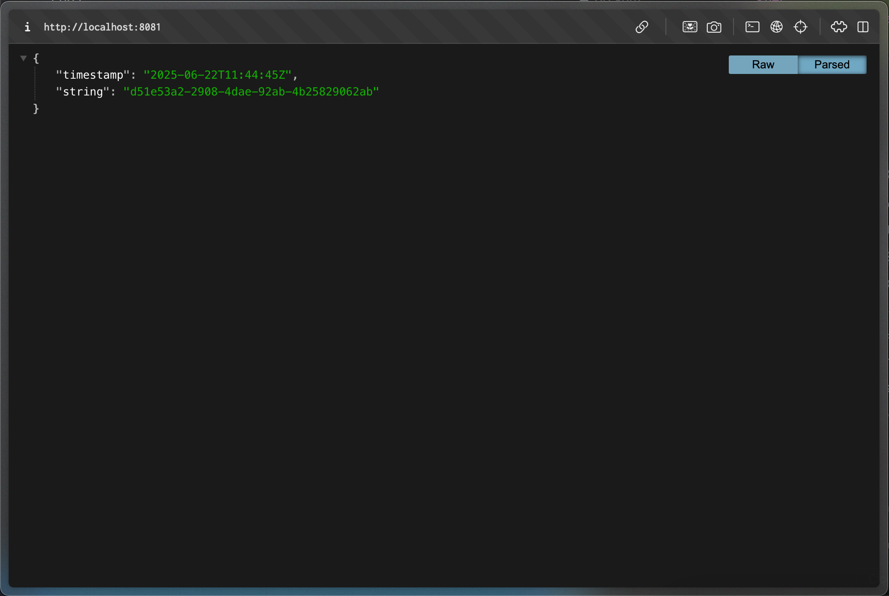
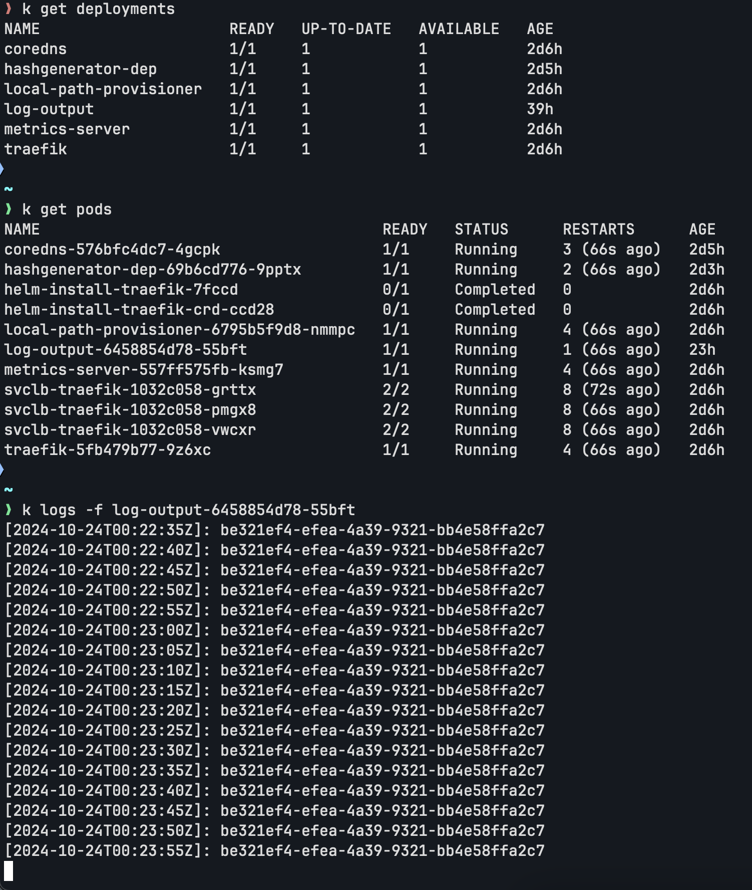

# Log Output Application

A simple Go application that generates timestamped log entries with a unique UUID every 5 seconds. Perfect for testing logging, monitoring, and Kubernetes deployments.

## Quick Start

### Prerequisites

- Docker
- k3d cluster
- kubectl configured to connect to your cluster

### Deploy to Kubernetes

1. Make the build script executable (if not already):

   ```bash
   chmod +x build-and-deploy.sh
   ```

2. Run the automated build and deploy script:

   ```bash
   ./build-and-deploy.sh
   ```

3. View the logs:
   ```bash
   kubectl logs -l app=log-output-app -f
   ```

### What the script does:

- Builds the Docker image from the Go source code
- Imports the image into your k3d cluster
- Deploys the application with Kubernetes manifests
- Shows deployment status

## Screenshot

### 1.7



Add an endpoint to request the current status (timestamp and the random string) and an Ingress so that you can access it with a browser.

### 1.1



_Example of the log output application running in Kubernetes, showing timestamped entries with UUID generated every 5 seconds._
