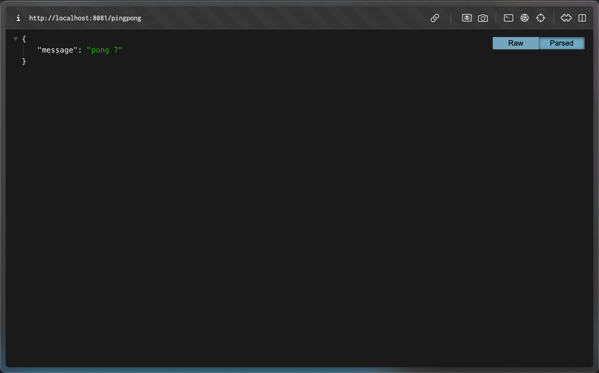

# PingPong Application

A simple Go web application that responds with "pong X" where X is an incrementing counter.



## Features

- Responds to GET requests on `/pingpong` endpoint
- Returns JSON response with format: `{"message": "pong X"}`
- Counter increments with each request
- Counter is stored in memory (resets on pod restart)
- Thread-safe counter implementation

## Running the Application

### Local Development

```bash
go run main.go
```

The application will start on port 8080.

### Docker Build and Deployment

```bash
./build-and-deploy.sh
```

This script will:

1. Build the Docker image
2. Import it into k3d cluster
3. Apply Kubernetes manifests
4. Show deployment status

## API Endpoints

- `GET /pingpong` - Returns pong response with counter
- `GET /` - Same as `/pingpong` (fallback)

## Example Response

```json
{
  "message": "pong 0"
}
```

The counter increments with each request: pong 0, pong 1, pong 2, etc.

## Kubernetes Resources

The application includes:

- Deployment with resource limits
- ClusterIP Service
- **Note**: Ingress is shared with LogOutput application (configured in LogOutput/manifests/ingress.yaml)

## Deployment Order

1. **First deploy LogOutput** (if not already deployed):

   ```bash
   cd ../LogOutput
   ./build-and-deploy.sh
   ```

2. **Then deploy PingPong**:
   ```bash
   cd ../PingPong
   ./build-and-deploy.sh
   ```

The shared ingress in LogOutput will route:

- `/pingpong` requests → PingPong service
- `/` requests → LogOutput service

