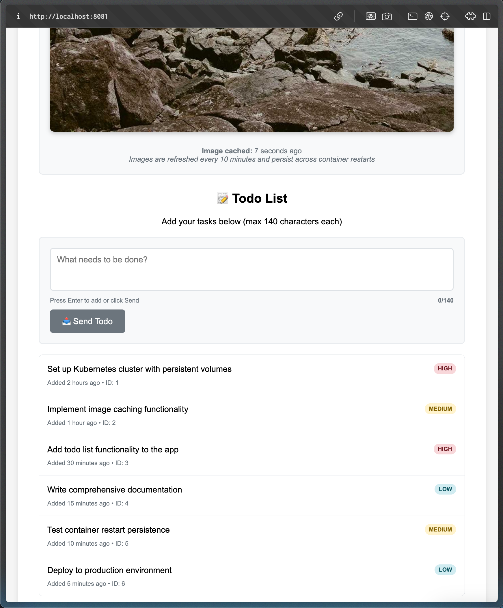
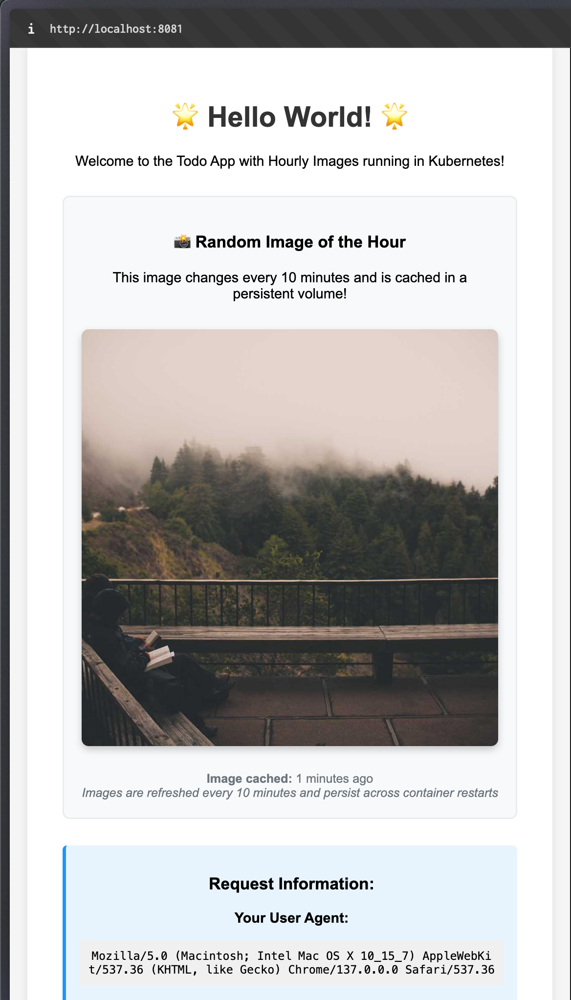

# Todo App with Hourly Images

A full-stack web application featuring a frontend that displays random images from Lorem Picsum and a backend todo API. The application demonstrates persistent data storage using Postgres StatefulSet, secure configuration management with Kubernetes Secrets and ConfigMaps, and intelligent image caching with persistent volumes.

## StatefulSet Database Implementation

This application showcases enterprise-grade stateful application deployment patterns:

### 🗄️ **Postgres StatefulSet**
- **Single-replica database** with persistent identity and storage
- **Headless service** for direct pod access
- **Dynamic volume provisioning** using K3s local-path storage
- **Persistent data** that survives pod restarts and StatefulSet deletion

### 🔐 **Secrets and ConfigMaps**
- **Database credentials** stored securely in Kubernetes Secret
- **Application configuration** externalized via ConfigMap
- **Environment-specific settings** separated from application code
- **Security best practices** with base64 encoded sensitive data

### 🏗️ **Key Components**

#### Database StatefulSet (`manifests/postgres-statefulset.yaml`)
- Postgres 15 with persistent 1Gi volume
- Headless service with `clusterIP: None`
- Credentials loaded from Secret
- Resource limits and health checks

#### Secret (`manifests/secret.yaml`)
```yaml
# Base64 encoded credentials:
POSTGRES_DB: tododb
POSTGRES_USER: todouser  
POSTGRES_PASSWORD: todopass123
```

#### ConfigMap (`manifests/configmap.yaml`)
```yaml
# Database connection
DB_HOST: postgres-stset-0.postgres-svc.project.svc.cluster.local
DB_PORT: 5432
DB_SSLMODE: disable

# Application settings
FRONTEND_PORT: 8080
BACKEND_PORT: 3001
IMAGE_URL: https://picsum.photos/1200
CACHE_DURATION_MINUTES: 10
```

#### Database Schema
```sql
CREATE TABLE todos (
    id SERIAL PRIMARY KEY,
    text TEXT NOT NULL,
    created_at TIMESTAMP DEFAULT CURRENT_TIMESTAMP,
    priority VARCHAR(10) DEFAULT 'medium'
);
```

### 🚀 **Deployment Architecture**

1. **Postgres StatefulSet** deploys first with persistent volume
2. **Secret and ConfigMap** provide configuration
3. **Todo Backend** connects to database using environment variables
4. **Frontend** communicates with backend via service discovery

## Screenshots

### 1.13



### 1.12



### 1.5


## Features

### Frontend Features
- 🖼️ **Hourly Random Images**: Fetches beautiful random images from Lorem Picsum
- 💾 **Persistent Image Caching**: Images are cached for 10 minutes and persist across container restarts
- 🔄 **Automatic Refresh**: Images automatically refresh every 10 minutes
- 🛡️ **Container Resilience**: Cached images survive pod crashes and restarts
- 🧪 **Testing Endpoint**: `/shutdown` endpoint for testing container restart scenarios
- 📊 **Request Information**: Displays user agent and request details

### Backend Features  
- 📝 **Todo Management**: RESTful API for creating and retrieving todos
- 🗄️ **Database Persistence**: All todos stored in Postgres database
- 🔄 **Connection Retry**: Automatic database connection retry with backoff
- 📊 **Statistics API**: Real-time todo counts and database status
- 🛡️ **Health Checks**: Database connectivity monitoring
- ⚡ **Performance**: Efficient queries with database indexing

## Quick Start

### Prerequisites

- Docker
- k3d cluster  
- kubectl configured to connect to your cluster

### Deploy to Kubernetes

1. Make the build script executable (if not already):

   ```bash
   chmod +x build-and-deploy.sh
   ```

2. Run the automated build and deploy script:

   ```bash
   ./build-and-deploy.sh
   ```

3. View the logs to see the server started message:

   ```bash
   kubectl logs -l app=todo-app -f
   ```

4. Test the application:
   ```bash
   # Test the frontend
   kubectl port-forward service/todo-app-service 8080:80 -n project
   # Open browser to http://localhost:8080
   
   # Test the backend API
   kubectl port-forward service/todo-backend-service 3001:3001 -n project
   # Test: curl http://localhost:3001/todos
   ```

### Testing Database Setup

Run the comprehensive test suite:

```bash
./test-database-setup.sh
```

This script validates:
- Database connectivity and schema
- Todo API functionality  
- Data persistence
- Frontend-backend integration
- Secret and ConfigMap configuration

### What the build script does:

1. **Creates namespace** `project` if it doesn't exist
2. **Deploys database** infrastructure:
   - Applies Secret with database credentials
   - Applies ConfigMap with application settings
   - Deploys Postgres StatefulSet with persistent volume
   - Waits for database to be ready
3. **Builds and deploys** applications:
   - Builds Docker images for frontend and backend
   - Imports images into k3d cluster
   - Deploys backend with database connectivity
   - Deploys frontend with image caching
   - Waits for all components to be ready
4. **Shows comprehensive status** including database, volumes, and secrets

## API Documentation

### Frontend Endpoints

- `GET /` - Main page with cached random image and todo list
- `GET /image` - Serves the current cached image directly  
- `GET /health` - Health check endpoint (returns "OK")
- `GET /headers` - Returns request headers for debugging
- `GET /shutdown` - Shuts down container (for testing restart persistence)

### Backend API Endpoints

#### Todos
- `GET /todos` - Retrieve all todos (sorted by creation date, newest first)
- `POST /todos` - Create a new todo
  ```json
  {
    "text": "Your todo text (max 140 chars)",
    "priority": "low|medium|high"
  }
  ```

#### System
- `GET /health` - Health check with database connectivity test
- `GET /stats` - Statistics including todo count and database status

#### Example API Usage

```bash
# Get all todos
curl http://localhost:3001/todos

# Create a new todo
curl -X POST http://localhost:3001/todos \
  -H "Content-Type: application/json" \
  -d '{"text":"Learn Kubernetes StatefulSets","priority":"high"}'

# Check system health and stats
curl http://localhost:3001/health
curl http://localhost:3001/stats
```

## Configuration Management

### Environment Variables (from ConfigMap)

**Frontend:**
- `FRONTEND_PORT` - Port for frontend server (default: 8080)
- `IMAGE_URL` - Source for random images (default: https://picsum.photos/1200)  
- `CACHE_DURATION_MINUTES` - Image cache duration (default: 10)
- `TODO_BACKEND_URL` - Backend service URL

**Backend:**
- `BACKEND_PORT` - Port for backend server (default: 3001)
- `DB_HOST` - Database hostname (StatefulSet pod FQDN)
- `DB_PORT` - Database port (default: 5432)
- `DB_SSLMODE` - Database SSL mode (default: disable)

### Secret Values (Base64 encoded)

- `POSTGRES_DB` - Database name
- `POSTGRES_USER` - Database username  
- `POSTGRES_PASSWORD` - Database password

### Updating Configuration

```bash
# Update application settings
kubectl edit configmap todo-app-config -n project

# Update database credentials (not recommended in production)
kubectl edit secret postgres-secret -n project

# View current configuration  
kubectl get configmap todo-app-config -n project -o yaml
kubectl get secret postgres-secret -n project -o yaml
```

## Data Persistence and Testing

### Database Persistence

- **Postgres data** persists in StatefulSet volume (`postgres-storage`)
- **Image cache** persists in frontend volume (`todo-app-images-pvc`)
- **Data survives** pod restarts, scaling, and StatefulSet deletion
- **Volume reclaim** policy ensures data safety

### Testing Persistence

1. **Create some todos** via the API or frontend
2. **Delete the StatefulSet**:
   ```bash
   kubectl delete statefulset postgres-stset -n project
   ```
3. **Redeploy** the StatefulSet:
   ```bash
   kubectl apply -f manifests/postgres-statefulset.yaml
   ```
4. **Verify data** is still there:
   ```bash
   kubectl exec -it postgres-stset-0 -n project -- psql -U todouser -d tododb -c 'SELECT * FROM todos;'
   ```

### Container Restart Testing

1. **Note current todos** in the application
2. **Restart backend pod**:
   ```bash
   kubectl delete pod -l app=todo-backend -n project
   ```
3. **Verify todos persist** after pod restart

## Database Management

### Direct Database Access

```bash
# Connect to database
kubectl exec -it postgres-stset-0 -n project -- psql -U todouser -d tododb

# View tables
kubectl exec -it postgres-stset-0 -n project -- psql -U todouser -d tododb -c '\dt'

# Check todo count  
kubectl exec -it postgres-stset-0 -n project -- psql -U todouser -d tododb -c 'SELECT COUNT(*) FROM todos;'

# View recent todos
kubectl exec -it postgres-stset-0 -n project -- psql -U todouser -d tododb -c 'SELECT id, text, priority, created_at FROM todos ORDER BY created_at DESC LIMIT 5;'
```

### Database Monitoring

```bash
# View database logs
kubectl logs -f postgres-stset-0 -n project

# Monitor database resource usage
kubectl top pod postgres-stset-0 -n project

# Check persistent volume status
kubectl get pvc -n project
kubectl describe pvc postgres-storage-postgres-stset-0 -n project
```

## Kubernetes Resources

The application creates the following Kubernetes resources:

### StatefulSet and Database
- **StatefulSet**: `postgres-stset` - Single-replica Postgres database
- **Headless Service**: `postgres-svc` - Direct pod access for database
- **PVC**: `postgres-storage-postgres-stset-0` - Database persistent volume (1Gi)

### Configuration and Secrets  
- **Secret**: `postgres-secret` - Database credentials (base64 encoded)
- **ConfigMap**: `todo-app-config` - Application configuration

### Applications
- **Deployment**: `todo-app` - Frontend with image caching
- **Deployment**: `todo-backend` - Backend API server
- **Service**: `todo-app-service` - Frontend service (port 80)
- **Service**: `todo-backend-service` - Backend service (port 3001)
- **PVC**: `todo-app-images-pvc` - Image cache storage

### Monitoring Commands

```bash
# Overall status
kubectl get all -n project

# Storage status
kubectl get pv,pvc -n project

# Configuration status  
kubectl get configmaps,secrets -n project

# Detailed pod information
kubectl describe pod postgres-stset-0 -n project
kubectl describe pod -l app=todo-backend -n project

# Resource usage
kubectl top pods -n project
```

## Development and Architecture

### Technology Stack

**Backend:**
- **Go 1.23** with database/sql and lib/pq driver
- **Postgres 15** for persistent todo storage
- **RESTful API** with JSON responses
- **Connection pooling** and retry logic

**Frontend:**  
- **Go 1.23** with html/template
- **HTTP client** for backend communication
- **Image caching** with persistent volumes
- **Responsive UI** with todo integration

**Infrastructure:**
- **Kubernetes StatefulSets** for database persistence
- **Secrets and ConfigMaps** for configuration management  
- **Persistent Volumes** for data and cache storage
- **Service discovery** for inter-service communication

### StatefulSet Benefits Demonstrated

1. **Persistent Identity**: Database pod maintains consistent network identity
2. **Ordered Operations**: Predictable startup and shutdown sequences  
3. **Persistent Storage**: Dedicated volumes that survive pod lifecycle
4. **Data Safety**: Volumes persist even after StatefulSet deletion
5. **Scaling**: Each replica gets its own dedicated storage (when scaled)

This implementation showcases production-ready patterns for stateful applications in Kubernetes!
