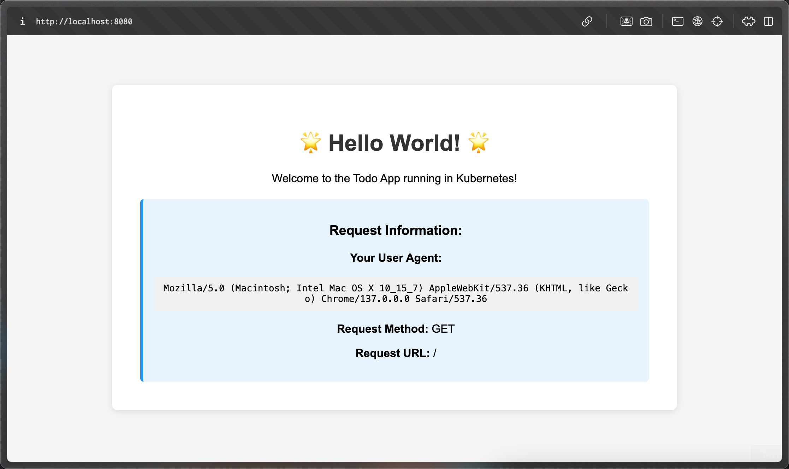

# Todo App with Hourly Images

A simple web server that displays random images from Lorem Picsum, with intelligent caching using Kubernetes persistent volumes. Features configurable port via environment variable, health check endpoint, and image persistence across container restarts.

## Screenshots

### 1.12


### 1.5



## Features

- 🖼️ **Hourly Random Images**: Fetches beautiful random images from Lorem Picsum
- 💾 **Persistent Image Caching**: Images are cached for 10 minutes and persist across container restarts
- 🔄 **Automatic Refresh**: Images automatically refresh every 10 minutes
- 🛡️ **Container Resilience**: Cached images survive pod crashes and restarts
- 🧪 **Testing Endpoint**: `/shutdown` endpoint for testing container restart scenarios
- 📊 **Request Information**: Displays user agent and request details

## Quick Start

### Prerequisites

- Docker
- k3d cluster
- kubectl configured to connect to your cluster

### Deploy to Kubernetes

1. Make the build script executable (if not already):

   ```bash
   chmod +x build-and-deploy.sh
   ```

2. Run the automated build and deploy script:

   ```bash
   ./build-and-deploy.sh
   ```

3. View the logs to see the server started message:

   ```bash
   kubectl logs -l app=todo-app -f
   ```

4. Test the application:
   ```bash
   kubectl port-forward service/todo-app-service 8080:80
   # Open browser to http://localhost:8080
   ```

### What the script does:

- Builds the Docker image from the Go source code
- Creates PersistentVolume and PersistentVolumeClaim for image storage
- Imports the image into your k3d cluster
- Deploys the application with persistent volume mounted
- Shows deployment status including persistent volumes

## Endpoints

- `GET /` - Main page with cached random image and request info
- `GET /image` - Serves the current cached image directly
- `GET /health` - Health check endpoint (returns "OK")
- `GET /headers` - Returns request headers for debugging
- `GET /shutdown` - Shuts down container (for testing restart persistence)

## Environment Variables

- `PORT` - Port number for the server to listen on (default: 8080)

## Image Caching Behavior

- Images are fetched from `https://picsum.photos/1200`
- Cache duration: **10 minutes**
- Cache location: `/app/images/current.jpg` (persistent volume)
- Background refresh: Checks every minute if refresh is needed
- On startup: Uses existing cached image if available, otherwise fetches new one
- Persistence: Images survive container restarts, pod deletions, and crashes

## Testing Container Restart Persistence

1. Port forward to the application:

   ```bash
   kubectl port-forward service/todo-app-service 8080:80
   ```

2. Note the current image and timestamp in your browser at `http://localhost:8080`

3. Shut down the container:

   ```bash
   curl http://localhost:8080/shutdown
   ```

4. Wait for pod to restart and refresh the browser - the same image should appear!

## Kubernetes Resources

The application creates the following Kubernetes resources:

- **PersistentVolume**: 1Gi storage for image caching
- **PersistentVolumeClaim**: Claims the persistent volume
- **Deployment**: Application deployment with volume mount
- **Service**: Exposes the application internally
- **Ingress**: (Optional) External access configuration

## Development

The application is built with:

- **Go 1.23**: Backend server
- **Alpine Linux**: Lightweight container base
- **Lorem Picsum API**: Random image source
- **Kubernetes Persistent Volumes**: Storage persistence
